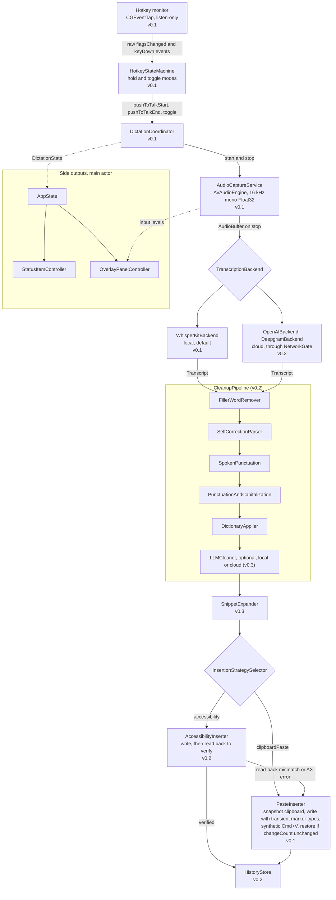
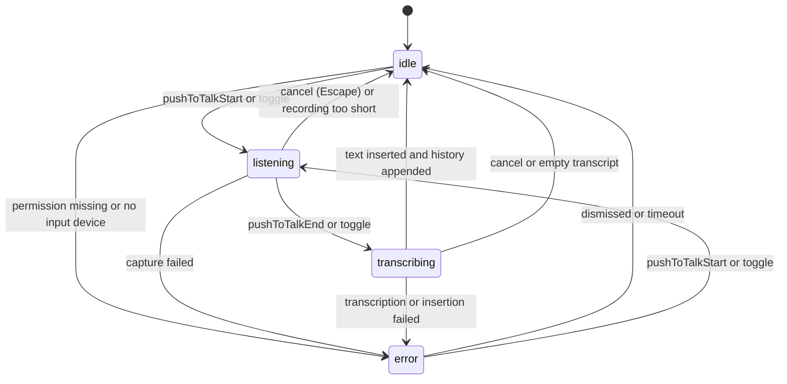
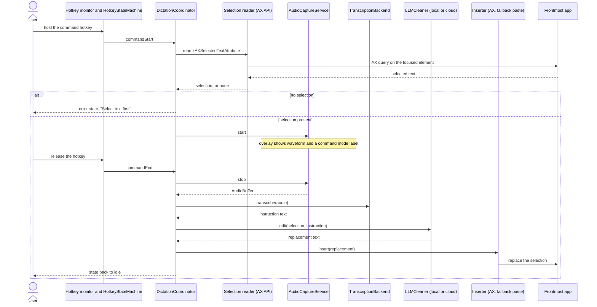

# Architecture

This document describes how Quoth is structured, what exists in the repository today, and what is planned for each milestone.

Status as of 2026-09-17: only the project skeleton is merged. That means the menu bar agent app shell, demo mode argument parsing, the UI test harness, and CI. Everything else in this document is the design that v0.1 through v1.0 will implement. Each section marks its parts as **Exists** or **Planned (milestone)**. When code and this document disagree, fix one of them in the same pull request.

## Contents

- [Overview](#overview)
- [Goals and constraints](#goals-and-constraints)
- [Module layout](#module-layout)
- [Dictation pipeline](#dictation-pipeline)
- [Cleanup pipeline](#cleanup-pipeline)
- [Dictation state](#dictation-state)
- [Command mode](#command-mode)
- [Protocol boundaries](#protocol-boundaries)
- [Threading model](#threading-model)
- [Privacy architecture](#privacy-architecture)
- [Demo mode and the screenshot pipeline](#demo-mode-and-the-screenshot-pipeline)
- [Build system](#build-system)
- [Decisions and tradeoffs](#decisions-and-tradeoffs)
- [Status summary](#status-summary)

## Overview

Quoth is a macOS menu bar app for voice dictation. The user holds a key, speaks, and releases. Quoth records the audio, transcribes it, cleans up the text, and inserts it at the cursor of whatever app is frontmost. Transcription runs on the device by default.

The app is a single process with no helper tools, no XPC services, and no server component. It is an agent app (`LSUIElement` is true in `App/Info.plist`, and `App/main.swift` sets the activation policy to `.accessory`), so it has no Dock icon and no main menu.

The code is split into two SwiftPM library targets and one thin Xcode app target:

| Piece | Path | Role |
| --- | --- | --- |
| QuothCore | `Sources/QuothCore/` | Pure Swift logic. Foundation only. |
| QuothKit | `Sources/QuothKit/` | Platform code: AppKit, SwiftUI, AVFoundation, Accessibility, WhisperKit. |
| Quoth (app target) | `App/` | `main.swift`, `Info.plist`, `Quoth.entitlements`. No logic. |
| QuothUITests | `UITests/` | XCUITest screenshot suite. Launches the app in demo mode. |

Facts that other sections rely on:

- Bundle id: `io.github.ryan-stoffel.quoth`. UI test bundle id: `io.github.ryan-stoffel.quoth.UITests`.
- Minimum macOS 14.0. The app builds for arm64 and x86_64.
- Swift tools version 5.10. Xcode 16 or newer to build. CI uses Xcode 26 on `macos-26` runners.
- License: MIT.

## Goals and constraints

These are the rules that shape every design choice below. A change that breaks one of them needs an issue and a discussion first.

1. **Menu bar only.** Quoth is an agent app. Its surfaces are an `NSStatusItem`, a popover, a recording overlay, and a small number of utility windows (Settings, History, Onboarding). `applicationShouldTerminateAfterLastWindowClosed` returns `false`, so closing a window never quits the app.
2. **Never steal focus.** The user is typing into another app when they dictate. If Quoth activates itself, the insertion target loses its cursor and the text goes nowhere. The overlay is a non-activating `NSPanel`. The hotkey path never calls `NSApp.activate`. Only windows the user opens on purpose (Settings, History, Onboarding) may become key.
3. **Local by default.** Nothing leaves the machine unless the user picks a cloud backend. See [Privacy architecture](#privacy-architecture).
4. **Minimal dependencies.** `Package.swift` has an empty `dependencies` array today. Two dependencies are pre-approved: WhisperKit (added by the v0.1 transcription issue) and Sparkle (added in v1.0, not before). Anything else needs an issue and maintainer sign-off. Every entry must carry a comment that says what it is for and why the SDK cannot do the job.
5. **Testable without hardware.** A CI runner has no microphone, no Accessibility permission, and no user to press a key. Every hardware or permission boundary sits behind a protocol with a fake. The whole UI can be opened in demo mode with seeded data. Real dictation is verified by hand with `docs/MANUAL_TEST.md` before each release and whenever a pull request touches audio, hotkey, transcription, or insertion code.

## Module layout

```
Package.swift            SwiftPM manifest: QuothCore, QuothKit, and their test targets
project.yml              XcodeGen spec: app target Quoth and UI test target QuothUITests
App/                     main.swift, Info.plist, Quoth.entitlements
Sources/QuothCore/       pure logic, Foundation only
Sources/QuothKit/        platform code
Tests/QuothCoreTests/    unit tests for Core
Tests/QuothKitTests/     unit tests for Kit pieces that run headlessly
UITests/                 XCUITest screenshot suite
scripts/                 bootstrap.sh, lint.sh, test.sh, capture-screenshots.sh, and CI helpers
```

Dependency direction is one way: `App` imports `QuothKit`, `QuothKit` imports `QuothCore`, `QuothCore` imports only Foundation.

### QuothCore

Pure, deterministic Swift. No AppKit, no SwiftUI, no AVFoundation, no network. It builds in seconds and its tests need no app host, no window server, and no permissions.

Exists today:

- `AppInfo` (`Sources/QuothCore/AppInfo.swift`): app name, bundle identifier, repository URL, and a version string read from a bundle.
- `DemoMode` (`Sources/QuothCore/DemoMode.swift`): parses `-demoMode` and `-demoScene` from a launch argument array. Covered by `Tests/QuothCoreTests/DemoModeTests.swift`.

Planned:

| Type | Milestone | Responsibility |
| --- | --- | --- |
| `DictationState` | v0.1 | `idle`, `listening`, `transcribing`, `error(message)`. |
| `HotkeyStateMachine` | v0.1 | Turns raw modifier and key events into `pushToTalkStart`, `pushToTalkEnd`, and `toggle` events. Hold mode and hands-free toggle mode. v0.3 adds command mode events for the second hotkey. |
| `TranscriptionBackend` protocol, `AudioBuffer`, `TranscriptionOptions`, `Transcript` | v0.1 | `func transcribe(_ audio: AudioBuffer, options: TranscriptionOptions) async throws -> Transcript`. Local and cloud backends conform. |
| `InsertionStrategySelector` | v0.1 (paste only), v0.2 (full) | Picks `accessibility` or `clipboardPaste` for the frontmost app from its bundle id and AX capability probes. |
| `SettingsStore` | v0.1, grows in v0.2 | Typed settings over `UserDefaults`. |
| `CleanupPipeline` and its rule stages | v0.2 | Ordered stages: `FillerWordRemover`, `SelfCorrectionParser`, `SpokenPunctuation`, `PunctuationAndCapitalization`, `DictionaryApplier`. |
| `HistoryStore`, `DictionaryStore` | v0.2 | JSON files in Application Support. |
| `SnippetExpander`, `SnippetStore` | v0.3 | Replaces spoken trigger phrases with stored text. |
| `LLMCleaner` protocol | v0.3 | Same shape as `TranscriptionBackend`. Local and cloud implementations. Optional final cleanup stage, and the editor for command mode. |
| `SecretStore` protocol | v0.3 | Keychain access for API keys. Needed only once a cloud backend exists. |

### QuothKit

Everything that touches a platform framework. Each platform service is written against a protocol so the coordinator above it can be tested with a fake.

Exists today:

- `AppDelegate` (`Sources/QuothKit/App/AppDelegate.swift`): holds the parsed `DemoMode`, keeps the app alive when the last window closes. `applicationDidFinishLaunching` is empty until the first v0.1 feature lands. Covered by `Tests/QuothKitTests/AppDelegateTests.swift`.

Planned:

| Type | Milestone | Responsibility |
| --- | --- | --- |
| `AppCoordinator`, `DictationCoordinator`, `AppState` | v0.1 | Own the pipeline and the observable state that the UI renders. |
| `StatusItemController` and the popover | v0.1 | `NSStatusItem` with a state-driven icon. SwiftUI hosted in an `NSPopover`. |
| `EventTapHotkeyMonitor` (also handles the Fn key) | v0.1 | Listen-only `CGEventTap` on `flagsChanged` and `keyDown`. |
| `AudioCaptureService` | v0.1 | `AVAudioEngine`, converts to 16 kHz mono Float32, publishes levels. |
| `OverlayPanelController` | v0.1 | Non-activating `NSPanel` with a waveform and elapsed time. Must never take focus. |
| `WhisperKitBackend` | v0.1 | On-device transcription. The default backend. |
| `PasteInserter` | v0.1 | Clipboard save, write, synthetic Cmd+V, restore. |
| `PermissionsService` | v0.1 | Microphone, Accessibility, Input Monitoring status and prompts. |
| `DemoScene` registry (`Sources/QuothKit/Demo/`) | v0.1, one scene per window as windows land | Maps a scene name to a window opened with seeded data. |
| `AccessibilityInserter` | v0.2 | `AXUIElement` write to `kAXSelectedTextAttribute`, with read-back verification. |
| Settings and History windows | v0.2 | SwiftUI hosted in `NSWindow`. |
| `OpenAIBackend`, `DeepgramBackend`, `NetworkGate`, `KeychainSecretStore` | v0.3 | Cloud transcription and the single outbound network gate. |
| Onboarding window, Sparkle updater | v1.0 | First-run permission walkthrough, auto-update. |

### App target

`App/main.swift` is eight lines. It creates an `AppDelegate` from QuothKit, sets the activation policy to `.accessory`, and runs the application. There is no `@main` struct, no storyboard, and no logic in the target.

### UITests

`UITests/ScreenshotHarness.swift` defines `ScreenshotTestCase`, the base class for the suite. `UITests/ScreenshotTests.swift` holds the tests. Today there is one test, `testLaunchesInDemoModeWithoutWindows`, which proves that the skeleton launches in demo mode, keeps running, and opens no window. See [Demo mode and the screenshot pipeline](#demo-mode-and-the-screenshot-pipeline).

### Why the split

- **Core is Foundation-only and fast to test.** The logic that is easiest to get subtly wrong (hotkey timing, self-correction parsing, punctuation rules, strategy selection) is pure functions and value types. `swift test` runs it without a window server, and the tests are deterministic.
- **Kit holds platform code behind protocols.** Event taps, audio engines, pasteboards, and AX elements cannot run on CI. Putting each one behind a protocol keeps the coordinator logic above them testable with fakes in `Tests/QuothKitTests/`.
- **The app target is a thin `main.swift`.** SwiftPM test targets cannot import an application target. Because the app delegate, coordinators, and windows all live in the QuothKit library, everything is reachable from SwiftPM tests. The Xcode project only packages the library into a signed `.app` bundle.

## Dictation pipeline

Status: **Planned.** None of the pipeline stages are merged. Milestones are marked in the diagram labels.



The same pipeline for terminals:

```
+---------------------------+
| Hotkey monitor            |   CGEventTap, listen-only                 v0.1
+---------------------------+
             | raw flagsChanged / keyDown events
             v
+---------------------------+
| HotkeyStateMachine        |   hold mode and toggle mode               v0.1
+---------------------------+
             | pushToTalkStart / pushToTalkEnd / toggle
             v
+---------------------------+  DictationState   +------------------------+
| DictationCoordinator      |- - - - - - - - - >| AppState               |
+---------------------------+                   |   StatusItemController |
             | start / stop                     |   OverlayPanelController
             v                                  +------------------------+
+---------------------------+  input levels                ^
| AudioCaptureService       |- - - - - - - - - - - - - - - +
| AVAudioEngine             |   16 kHz mono Float32                     v0.1
+---------------------------+
             | AudioBuffer (on stop)
             v
+---------------------------+
| TranscriptionBackend      |   WhisperKitBackend (local, default)      v0.1
|                           |   OpenAIBackend, DeepgramBackend (cloud)  v0.3
+---------------------------+
             | Transcript
             v
+---------------------------+
| CleanupPipeline           |                                           v0.2
|  1 FillerWordRemover      |
|  2 SelfCorrectionParser   |
|  3 SpokenPunctuation      |
|  4 PunctuationAndCapitalization
|  5 DictionaryApplier      |
|  6 LLMCleaner (optional)  |   local or cloud                          v0.3
+---------------------------+
             |
             v
+---------------------------+
| SnippetExpander           |                                           v0.3
+---------------------------+
             |
             v
+---------------------------+
| InsertionStrategySelector |
+---------------------------+
      | accessibility                 | clipboardPaste
      v                               v
+----------------------+  fail  +------------------------------+
| AccessibilityInserter|------->| PasteInserter                |      v0.1
| write, read back     |        |  snapshot clipboard          |
| to verify       v0.2 |        |  write + transient markers   |
+----------------------+        |  synthetic Cmd+V             |
      | verified                |  restore if changeCount same |
      |                         +------------------------------+
      |                               |
      +---------------+---------------+
                      v
           +---------------------+
           | HistoryStore        |                                      v0.2
           +---------------------+
                      |
                      v
               state -> idle
```

Stage notes:

1. **Hotkey monitor.** A `CGEventTap` created with the listen-only option on `flagsChanged` and `keyDown`. It observes events and never modifies or swallows them. It forwards raw events and holds no timing logic.
2. **HotkeyStateMachine.** A pure value type in Core. It decides whether a sequence of raw events is a push-to-talk hold, a toggle, or noise (for example the hotkey modifier pressed as part of an unrelated shortcut). All timing is injected, so tests do not sleep.
3. **DictationCoordinator.** The only component that mutates `DictationState`. It sequences the stages, handles cancellation, and turns thrown errors into the `error` state.
4. **AudioCaptureService.** Installs a tap on the `AVAudioEngine` input node, converts the hardware format to 16 kHz mono Float32 (the input format Whisper models expect), and accumulates samples in memory. It publishes a smoothed input level for the overlay waveform. `stop` returns one `AudioBuffer`. Nothing is written to disk.
5. **TranscriptionBackend.** One async call per utterance. `WhisperKitBackend` is the default. Cloud backends exist only from v0.3 and are reachable only through `NetworkGate`.
6. **CleanupPipeline.** Rule stages run in a fixed order because each depends on the one before it. Fillers are removed before self-corrections are resolved. Spoken punctuation ("comma", "new line") is converted before automatic punctuation and capitalization. Dictionary replacements run last among the rules so they see final word boundaries. The optional `LLMCleaner` runs after the rules, so the model receives already-normalized text and can be skipped without changing the rule output.
7. **SnippetExpander.** Runs after cleanup so that an LLM stage cannot rewrite the expanded snippet body. The module list in `AGENTS.md` and `CLAUDE.md` names `SnippetExpander` inside the `CleanupPipeline` stage list, before `LLMCleaner`, while the pipeline definition in the same files puts it after `CleanupPipeline.run`. The order in this document (rules, optional `LLMCleaner`, then `SnippetExpander` as a separate step) is the intended one. The v0.3 snippet issue must correct the stage list in those two files when it implements the stage.
8. **InsertionStrategySelector.** Pure function in Core. Inputs: frontmost bundle id, results of AX capability probes, user overrides. Output: `accessibility` or `clipboardPaste`.
9. **AccessibilityInserter.** Writes `kAXSelectedTextAttribute` on the focused element, then reads the element value back and checks that the text is present. A mismatch or an AX error triggers the paste fallback. See [Decisions and tradeoffs](#decisions-and-tradeoffs).
10. **PasteInserter.** Snapshots every item and type on the general pasteboard, writes the text together with the transient and concealed marker types that clipboard managers honor, records `changeCount`, posts a synthetic Cmd+V, waits briefly, and restores the snapshot only if `changeCount` is unchanged. If the count moved, the user or another app wrote to the clipboard in the meantime and their content wins.
11. **HistoryStore.** Appends the final text with a timestamp and the target app. History can be cleared or disabled in settings.

## Cleanup pipeline

Exists today (v0.2, issue #24). `CleanupPipeline` in `QuothCore` runs between transcription and insertion. The overlay keeps showing Transcribing while it runs.

Stage order is the order of `CleanupStages.standard`, and `SettingKeys.cleanupStageIDs` lists the same ids so every stage has a toggle. The planned order is: filler word removal, self-correction, spoken formatting, punctuation and capitalization, dictionary, then the optional model-backed step (`AsyncCleanupStep`), then snippet expansion. Only the stages that are merged appear in `CleanupStages.standard`.

Toggles and fallbacks:

- `cleanup.enabled` is the global toggle. When it is off, every stage is bypassed except stages whose `followsGlobalToggle` is false (spoken formatting, so that "new line" keeps working).
- Each stage has `cleanup.stage.<id>.enabled`.
- A stage that throws is skipped. The error goes into the trace and the previous text carries on.
- The model-backed step has a timeout (5 seconds by default). On timeout or error the rule-based result is used.
- If the final text is blank, the raw transcript is inserted, so a bug in a stage never makes a dictation vanish.
- `CleanupResult` carries the raw text, the final text, and a per-stage trace. The trace is dictated text: it stays in memory, is only persisted as part of a history entry, and is never logged.

## Dictation state

Status: **Planned (v0.1).** `DictationState` lives in QuothCore. `DictationCoordinator` is the only writer.



Rules:

- `transcribing` covers transcription, cleanup, snippet expansion, and insertion. The user sees one "working" state, not four.
- Cancel while `listening` discards the audio buffer. Cancel while `transcribing` cancels the Swift task, and no text is inserted even if the backend has already returned.
- A recording shorter than a minimum duration is treated as an accidental tap and dropped without an error.
- An empty transcript (silence) returns to `idle` without inserting anything and without a history entry.
- `error(message)` is shown in the status item and the overlay. A new hotkey press from `error` starts a new dictation, so an error never blocks the user.
- A hotkey press while `transcribing` is ignored in v0.1. Queuing a second utterance is out of scope until there is a reason to add it.

## Command mode

Status: **Planned (v0.3).** Command mode edits existing text. The user selects text, holds a second hotkey, and speaks an instruction such as "make this more formal". The spoken words are the instruction, not the content.



Notes:

- `commandStart` and `commandEnd` are working names for two events that the v0.3 command mode issue adds to `HotkeyStateMachine` for the second hotkey. They do not exist in the v0.1 event set.
- The selection is read before capture starts, while the target app still has its selection. If the AX read fails (some apps do not expose selected text), the fallback is a synthetic Cmd+C with the same clipboard snapshot and restore logic that `PasteInserter` uses.
- The rule-based `CleanupPipeline` does not run on the instruction. The instruction goes to the LLM as transcribed.
- The selection is still active when the replacement is inserted, so both inserters replace it in place.
- Command mode requires an `LLMCleaner`. If the selected one is a cloud implementation, the selection and the instruction leave the machine, and the request passes through `NetworkGate` like any other.

## Protocol boundaries

Every boundary below exists so the code above it can run in `swift test` without hardware, permissions, or a network. The first protocol signature is fixed by the project spec. The other protocol names are the working names for the planned issues and may change when they are implemented. The rule that each boundary has a fake does not change.

Status: **Planned.** No protocol in this table is merged yet.

| Protocol | Module | Production implementation | Test fake | Milestone |
| --- | --- | --- | --- | --- |
| `HotkeyMonitoring` | Kit | `EventTapHotkeyMonitor` (listen-only `CGEventTap`) | `FakeHotkeyMonitor`, emits scripted raw events | v0.1 |
| `AudioCapturing` | Kit | `AudioCaptureService` (`AVAudioEngine`) | `FakeAudioCapture`, returns a fixed `AudioBuffer` and scripted levels | v0.1 |
| `TranscriptionBackend` | Core | `WhisperKitBackend` | `FakeTranscriptionBackend`, returns a canned `Transcript` or throws | v0.1 |
| `TranscriptionBackend` | Core | `OpenAIBackend`, `DeepgramBackend` | same fake, plus a stub `HTTPTransport` | v0.3 |
| `TextInserting` | Kit | `PasteInserter` | `RecordingInserter`, records the text it was asked to insert | v0.1 |
| `TextInserting` | Kit | `AccessibilityInserter` | `RecordingInserter`, plus a fake AX element that drops writes | v0.2 |
| `PasteboardAccessing` | Kit | wrapper over `NSPasteboard.general` | `FakePasteboard` with a controllable `changeCount` | v0.1 |
| `EventPosting` | Kit | `CGEvent` poster for synthetic Cmd+V | `RecordingEventPoster` | v0.1 |
| `PermissionsChecking` | Kit | `PermissionsService` | `FakePermissions`, any combination of granted and denied | v0.1 |
| `FrontmostAppProviding` | Kit | `NSWorkspace` plus AX capability probes | `FakeFrontmostApp`, fixed bundle id and probe results | v0.1 |
| `Clock` (injected time) | Core | system clock | `ManualClock`, advanced by the test | v0.1 |
| `LLMCleaner` | Core | local and cloud implementations | `FakeLLMCleaner` | v0.3 |
| `SecretStore` | Core | `KeychainSecretStore` | `InMemorySecretStore` | v0.3 |
| `HTTPTransport` (behind `NetworkGate`) | Kit | `URLSession` transport | `StubTransport`, records requests and returns canned responses | v0.3 |
| File location for `HistoryStore`, `DictionaryStore`, `SnippetStore` | Core | Application Support directory | temporary directory per test | v0.2, v0.3 |

Demo mode will use the same seams. In demo mode the coordinator will be built with no-op or seeded demo implementations that live in `Sources/QuothKit/Demo/` (not the test fakes, which stay in the test targets), which is how the app will guarantee that it touches no microphone, event tap, Accessibility API, Keychain, or network.

## Threading model

Status: **Planned (v0.1).** The skeleton runs only the AppKit main thread today.

| Work | Where it runs | Why |
| --- | --- | --- |
| `AppState`, `DictationState` mutation, `StatusItemController`, `OverlayPanelController`, popover, all windows | `@MainActor` | AppKit and SwiftUI require it, and a single writer keeps state transitions ordered. |
| `DictationCoordinator` | `@MainActor` | It sequences the pipeline and mutates state. It awaits the heavy stages and does no heavy work itself. |
| Event tap callback | Run loop source on the main run loop | The callback does no work. It forwards the raw event to `HotkeyStateMachine`, which is pure and cheap. A slow tap callback makes the system disable the tap, so nothing blocking may ever run here. |
| `AVAudioEngine` tap callback | A real-time audio thread owned by AVFoundation | The callback must not block, allocate heavily, or touch UI. It converts the buffer and hands it to an actor. |
| Sample accumulation | A dedicated `actor` owned by `AudioCaptureService` | The capture callback thread hands buffers to the actor, which serializes appends and returns the final `AudioBuffer` on stop. |
| Level metering | Computed in the capture path, delivered to the main actor at display rate | The overlay needs about 30 updates per second, not one per audio buffer. |
| `TranscriptionBackend.transcribe` | Off the main actor | Core ML inference takes hundreds of milliseconds to seconds. |
| `CleanupPipeline.run`, `SnippetExpander` | Off the main actor | Pure functions over strings. Cheap, but there is no reason to run them on the UI thread. |
| `LLMCleaner` | Off the main actor | Inference or a network call. |
| Insertion (AX calls, pasteboard, synthetic events) | Off the main actor for AX calls, which are synchronous IPC to another process and can stall | A hung target app must not freeze the overlay or the menu bar. AX calls use a messaging timeout. |
| Store reads and writes | Each store is an `actor` | Serialized file access, no locks. |

Cancellation uses Swift structured concurrency. The coordinator holds one `Task` per dictation. Cancel calls `task.cancel()`, and each stage checks for cancellation before it produces a side effect. Insertion is the point of no return: once the synthetic Cmd+V is posted, the dictation completes.

Types that cross actor boundaries (`AudioBuffer`, `Transcript`, `TranscriptionOptions`, `DictationState`) are `Sendable` value types. `DemoMode` already is.

## Privacy architecture

The rule, from the project spec: nothing leaves the machine unless the user picks a cloud backend. With local backends selected, the app makes no network requests other than the one-time model download from Hugging Face by WhisperKit and the Sparkle update check (which can be disabled). API keys live only in the Keychain. Audio is never written to disk. History is stored locally and can be cleared or disabled.

Exists today: the skeleton contains no networking code, no Keychain code, and no audio code. The only entitlement in `App/Quoth.entitlements` is `com.apple.security.device.audio-input`.

Planned mechanisms:

### NetworkGate (v0.3)

Every outbound request that Quoth code makes goes through one type, `NetworkGate`. `NetworkGate` and the `URLSession`-backed `HTTPTransport` it owns (one file) are the only places in the codebase allowed to reference `URLSession`. Backends never see the transport; they call the gate. The gate takes the request and a declared purpose (cloud transcription, cloud LLM cleanup), reads the current settings, and refuses with a thrown error unless a cloud backend is selected for that purpose. A refusal is not a silent no-op, so a bug that tries to send data while local backends are selected fails loudly in tests and in use.

This gives three properties:

- **One place to audit.** A reviewer can confirm the privacy rule by reading one file and searching the repository for `URLSession`, which must match nowhere else.
- **One place to test.** Unit tests build the gate with local settings and assert that every request type is refused. With cloud settings they assert that only the selected provider's host is allowed.
- **Demo mode is offline by construction.** In demo mode the gate is built in a refuse-everything configuration.

Two network paths are outside the gate because they belong to dependencies, and both are documented to the user: the one-time WhisperKit model download from Hugging Face (v0.1), which happens only when the user asks for a model that is not on disk, and the Sparkle update check (v1.0), which can be disabled in settings.

### SecretStore (v0.3)

API keys for cloud backends are stored only in the Keychain through the `SecretStore` protocol. Keys are never written to `UserDefaults`, JSON files, logs, or history. The settings UI shows whether a key is present, not the key. Tests use the in-memory fake from the test targets, and demo mode will use an in-memory demo implementation from `Sources/QuothKit/Demo/`, so neither touches the real Keychain.

### Audio only in memory (v0.1)

`AudioCaptureService` accumulates samples in memory. The `AudioBuffer` is passed to the backend and released when transcription finishes, fails, or is cancelled. There is no temporary audio file and no debug option that writes one. Cloud backends encode the upload from memory.

### Local data (v0.2)

History, dictionary, and snippets are JSON files under `~/Library/Application Support/Quoth/`. History stores text, not audio. The user can clear it or turn it off, and turning it off means `HistoryStore.append` is never called, not that entries are hidden.

### Permissions (v0.1)

| Permission | Used for |
| --- | --- |
| Microphone | Capture. |
| Accessibility | Posting the synthetic Cmd+V and using the AX API. |
| Input Monitoring | The listen-only `CGEventTap` that sees the Fn key. |

The event tap is listen-only. Quoth can observe key events in order to detect its hotkey. It does not record them, and it cannot modify or block them.

## Demo mode and the screenshot pipeline

Every pull request body has a `## Before and After` section. CI fills it with before and after screenshots of every window; a pull request that changes no UI writes `No UI change` there instead (see `CONTRIBUTING.md`). Real dictation cannot run on a CI runner, so the app has a demo mode that opens any window with seeded data and no hardware.

### Launch arguments

Status: **Exists** (parsing). **Planned** (scenes, as each window lands).

```
Quoth.app/Contents/MacOS/Quoth -demoMode YES -demoScene settings-general
```

`DemoMode.init(arguments:)` in `Sources/QuothCore/DemoMode.swift` reads the process arguments:

- `-demoMode` followed by `yes`, `true`, or `1` (case-insensitive) enables demo mode. Anything else, or a missing value, leaves it off.
- `-demoScene <name>` names the scene. It is ignored unless demo mode is on.
- A value that starts with `-` is treated as the next flag, not as a value.

`AppDelegate` parses the arguments in its initializer and exposes the result as `demoMode`. The initializer takes a `DemoMode` parameter so tests can inject one.

Planned behavior in demo mode: the app never touches the microphone, event taps, Accessibility, the Keychain, or the network. It uses seeded in-memory data with fixed dates, and it opens the named scene immediately. Fixed dates matter: a relative timestamp such as "2 minutes ago" would make every screenshot differ between runs.

Scenes are registered in `DemoScene` (`Sources/QuothKit/Demo/`, planned). Scene names equal screenshot file names. Planned scenes: `popover`, `overlay-listening`, `overlay-transcribing`, `settings-general`, `settings-hotkeys`, `settings-audio`, `settings-transcription`, `settings-cleanup`, `settings-dictionary`, `settings-snippets`, `settings-privacy`, `history`, `onboarding-welcome`, `onboarding-microphone`, `onboarding-accessibility`. Every new window or tab must add a scene and a UI test in the same pull request.

### XCUITest harness

Status: **Exists.**

`ScreenshotTestCase` in `UITests/ScreenshotHarness.swift` provides two helpers:

- `launch(scene:extraArguments:)` starts the app with `-demoMode YES`, the optional `-demoScene <name>`, and `-AppleLanguages (en) -AppleLocale en_US` so text and date formats are the same on every machine.
- `capture(_:named:timeout:)` waits for an element to exist, takes `element.screenshot()`, wraps it in an `XCTAttachment`, sets the attachment name to the scene name, and sets the lifetime to `.keepAlways` so the image is kept in the result bundle when the test passes.

A scene test will look like this once the first window exists:

```swift
func testSettingsGeneral() {
    launch(scene: "settings-general")
    capture(app.windows.firstMatch, named: "settings-general")
}
```

The only test today, `testLaunchesInDemoModeWithoutWindows`, launches with no scene and asserts that the app is running and has zero windows. The pipeline below therefore runs end to end and exports zero images, which is the correct result for the skeleton.

### Export from the result bundle

Status: **Exists.**

`scripts/capture-screenshots.sh <source-dir> <output-dir>`:

1. Exits 0 with a message if `<source-dir>` has no `project.yml` or no `UITests` directory. This lets CI point the script at a merge base that predates the suite.
2. Runs `xcodegen generate --quiet` in `<source-dir>`.
3. Runs `xcodebuild test` on scheme `Quoth` with `-destination "platform=macOS"`, `-only-testing:QuothUITests`, `CODE_SIGN_IDENTITY=-`, and `-resultBundlePath` set to a temporary `screenshots.xcresult`. The DerivedData location comes from the `DERIVED_DATA_PATH` environment variable and defaults to `<source-dir>/DerivedData`.
4. Runs `xcrun xcresulttool export attachments --path <bundle> --output-path <dir>`, which writes the attachment files and a `manifest.json`.
5. Reads the manifest with an inline Python script. Attachments whose `suggestedHumanReadableName` matches `<name>_<index>_<uuid>.png` are copied to `<output-dir>/<name>.png`. Anything else, such as the automatic failure screenshots XCTest adds, is skipped.
6. Exits with the `xcodebuild` status and prints the log tail on failure. Images captured before a failure are still exported.

### Publishing

Status: **Exists.**

`.github/workflows/screenshots.yml` has two jobs.

Job `screenshots` runs on pull requests (`opened`, `reopened`, `synchronize`, `ready_for_review`):

1. Checks out the PR head into `head/`, finds the merge base with the base branch, and adds a detached worktree for it at `base/`.
2. Runs `head/scripts/capture-screenshots.sh base shots/before`, then `head/scripts/capture-screenshots.sh head shots/after`. The script always comes from the PR head, so a base commit that predates the script or has a broken suite still yields a table. A failure on the base is a warning. A failure on the head fails the job.
3. Uploads `shots/` as the workflow artifact `screenshots-pr-<number>`.
4. For branches in the main repository: commits the images to the orphan `screenshots` branch under `pr-<number>/before/` and `pr-<number>/after/`, retrying up to five times if another run pushes first.
5. Builds a two-column table with `scripts/pr_screenshots.py table`, using `raw.githubusercontent.com` URLs pinned to the commit SHA on the `screenshots` branch, so the images in an old PR never change. `scripts/pr_screenshots.py splice` writes the table between the `<!-- screenshots:start -->` and `<!-- screenshots:end -->` markers in the PR body.
6. Verifies the result with `scripts/check_pr.py before-after --require-images`.

Pull requests from forks get a read-only token. For forks the push and the body edit are skipped, the images stay available as the workflow artifact, and a maintainer re-runs the capture from a branch in the main repository.

Job `latest` runs on pushes to `develop`. It captures the suite once and publishes the images to `latest/` on the `screenshots` branch, which is where `README.md` image links point.

The workflow uses only `GITHUB_TOKEN` with `contents: write` and `pull-requests: write`, and one concurrency group per pull request so a new push cancels the capture for the previous one. The `screenshots` branch is written only by CI. Never commit to it by hand, never merge it.

## Build system

Status: **Exists.**

### SwiftPM for libraries and unit tests

`Package.swift` (tools version 5.10, platform macOS 14) declares `QuothCore`, `QuothKit` (depends on Core), `QuothCoreTests`, and `QuothKitTests`. The `dependencies` array is empty.

```
swift build
swift test
scripts/test.sh unit
```

Unit tests need no Xcode project and no code signing. In CI, the `unit-tests` job runs `swift build --build-tests` and then `swift test --skip-build`.

### XcodeGen for the app and the UI test bundle

SwiftPM cannot produce a macOS `.app` bundle with an `Info.plist`, entitlements, the hardened runtime, and a code signature, and it cannot build an XCUITest bundle. `project.yml` defines those two targets:

- `Quoth` (`application`): sources from `App/`, links the `QuothKit` product of the local package (`packages: Quoth: path: .`), `INFOPLIST_FILE: App/Info.plist`, `CODE_SIGN_ENTITLEMENTS: App/Quoth.entitlements`, hardened runtime on, ad hoc signing (`CODE_SIGN_IDENTITY: "-"`) for local and CI builds.
- `QuothUITests` (`bundle.ui-testing`): sources from `UITests/`, `TEST_TARGET_NAME: Quoth`.
- Scheme `Quoth`: builds both targets, tests `QuothUITests`, archives in Release.

```
scripts/bootstrap.sh
xcodegen generate
xcodebuild -project Quoth.xcodeproj -scheme Quoth -destination 'platform=macOS' build
scripts/test.sh ui
```

`scripts/bootstrap.sh` installs `xcodegen`, `swiftformat`, and `swiftlint` with Homebrew when they are missing (the same as `brew install xcodegen swiftformat swiftlint`) and then generates the project. `scripts/test.sh ui` regenerates the project, runs the UI tests, and writes the result bundle to `build/ui-tests.xcresult`. The `ui-tests` CI job uploads that bundle as an artifact when the job fails.

### Why the project file is generated

`Quoth.xcodeproj` is never committed.

- A `.pbxproj` is a large machine-written file with opaque object ids. Two branches that each add a file produce merge conflicts that say nothing about intent. `project.yml` is short enough for a reviewer to read in full.
- Almost all source files live in SwiftPM targets, which discover files by directory. Adding a source file needs no project change at all.
- CI, contributors, and coding agents all generate the same project from the same spec, so "works in my Xcode" differences cannot hide in local project state.

The cost is one extra command after checkout and after any change to `project.yml`. `scripts/bootstrap.sh`, `scripts/test.sh`, and `scripts/capture-screenshots.sh` all run `xcodegen generate` themselves.

Generated and never committed: `Quoth.xcodeproj`, `.build/`, `DerivedData/`, `build/`, `screenshots/`.

### Lint

`scripts/lint.sh` runs `swiftformat --lint` and `swiftlint lint --strict` over `Package.swift`, `App`, `Sources`, `Tests`, and `UITests`. `scripts/lint.sh --fix` formats first and then checks. Configuration is in `.swiftformat` and `.swiftlint.yml`. The `lint` CI job runs the same script.

### CI checks

Required checks on `develop` and `main`: `lint`, `unit-tests`, `ui-tests` (all in `ci.yml`), `branch-name`, `linked-issue`, `pr-format`, and `screenshots`. The job names are the check names. Do not rename them. `release.yml` runs on `v*` tags and is described in `docs/RELEASING.md`.

## Decisions and tradeoffs

### Listen-only event tap, not an active tap

An active tap (`.defaultTap`) can swallow events. That would let Quoth stop the Fn press from also opening the emoji picker or starting system dictation. But an active tap sits in the input path of every keystroke on the machine. If its callback stalls, typing stalls system-wide until macOS disables the tap. It also gives the process the power to alter keystrokes, which is a lot to ask a user to trust.

Quoth uses a listen-only tap. It needs Input Monitoring, cannot alter or delay input, and fails safe: if the tap is disabled, the hotkey stops working and nothing else breaks. The cost is that Quoth cannot suppress what the system does with the same key. For the Fn key, onboarding (v1.0) will tell the user to set "Press Fn key to" to "Do Nothing" in System Settings, and the hotkey is configurable (v0.2 settings) for users who prefer another key.

### Paste first in v0.1, Accessibility first from v0.2, always with read-back

Clipboard paste works in nearly every app, which is why v0.1 ships it alone. Its costs: it briefly touches the user's clipboard, it depends on a timed restore, and it can show up in clipboard managers. The snapshot and restore, the transient marker types, and the `changeCount` check reduce these costs but do not remove them.

Writing `kAXSelectedTextAttribute` has none of those costs and is the first choice from v0.2. But it is unreliable in a specific, bad way: Chromium browsers and Electron apps often return success for the AX write and silently drop the text. An inserter that trusts the return code would lose dictations in Chrome, Slack, VS Code, and similar apps with no error. So `AccessibilityInserter` always reads the value back and verifies that the text landed. If it did not, `PasteInserter` runs. `InsertionStrategySelector` also sends bundle ids known to drop AX writes straight to paste, to skip the wasted attempt and its latency.

### JSON files instead of a database

History, dictionary, and snippets are small: thousands of short records at most. JSON files in Application Support need no dependency, no schema migration tooling, and no ORM. Users can read, back up, and delete them with Finder. Tests point a store at a temporary directory. The costs are whole-file rewrites and no indexed queries. History search is a linear scan, which is fast at this size. If history ever needs an index, SQLite can replace the file behind the same `HistoryStore` interface without touching callers.

### No App Sandbox

Quoth is not sandboxed and will not ship on the Mac App Store. A sandboxed app cannot post synthetic key events to other apps or use the Accessibility API to write into another app's text field, and inserting text at the cursor of any app is the core function. The hardened runtime is enabled (`ENABLE_HARDENED_RUNTIME: YES` in `project.yml`), and the only entitlement is audio input. Releases will be signed with a Developer ID and notarized (v1.0). The user-visible permission surface is the three TCC prompts listed under [Permissions](#permissions-v01).

### WhisperKit is unsupported on Intel

WhisperKit runs Whisper with Core ML and does not officially support Intel Macs. The app still builds universal (arm64 and x86_64) so there is one download, and the menu bar, settings, and history work everywhere. On Intel, `WhisperKitBackend` reports itself unavailable, and a cloud backend (v0.3) is required to dictate. Until v0.3, dictation does not work on Intel Macs. The README and the transcription settings tab must say so plainly.

### Logic in a library, not in the app target

Keeping all logic in QuothKit costs one extra module boundary and `public` on the handful of types the app target touches. In return, SwiftPM tests can reach everything, and the generated Xcode project carries almost no state that matters.

### Squash into develop, merge commit into main

The pull request rules that produce the history are in `CONTRIBUTING.md`. In short: squash merge only into `develop`, merge commit from `develop` into `main`. Each commit on `develop` is one issue with a Conventional Commits title, and `main` keeps a merge commit per release.

## Status summary

| Area | Status | Milestone |
| --- | --- | --- |
| SwiftPM package, `QuothCore`, `QuothKit`, test targets | Exists | skeleton |
| `AppInfo`, `DemoMode` argument parsing | Exists | skeleton |
| Agent app shell (`main.swift`, `AppDelegate`, `LSUIElement`, entitlements) | Exists | skeleton |
| XcodeGen project spec, scripts, SwiftFormat and SwiftLint configuration | Exists | skeleton |
| UI test harness (`ScreenshotTestCase`) and the launch smoke test | Exists | skeleton |
| CI: `ci.yml`, `branch-name.yml`, `linked-issue.yml`, `pr-format.yml`, `screenshots.yml`, `release.yml` | Exists | skeleton |
| Status item and popover, `AppState`, `DictationState`, coordinators | Planned | v0.1 |
| Hotkey monitor and `HotkeyStateMachine` | Planned | v0.1 |
| `AudioCaptureService`, `OverlayPanelController` | Planned | v0.1 |
| `WhisperKitBackend` and the WhisperKit dependency | Planned | v0.1 |
| `PasteInserter`, `PermissionsService` | Planned | v0.1 |
| `DemoScene` registry and the first scenes | Planned | v0.1 |
| `CleanupPipeline` rule stages, `DictionaryStore`, `HistoryStore` | Planned | v0.2 |
| `AccessibilityInserter` with read-back, full `InsertionStrategySelector` | Planned | v0.2 |
| Settings and History windows | Planned | v0.2 |
| `SnippetExpander`, `SnippetStore` | Planned | v0.3 |
| Command mode, `LLMCleaner` | Planned | v0.3 |
| `OpenAIBackend`, `DeepgramBackend`, `NetworkGate`, `KeychainSecretStore` | Planned | v0.3 |
| Onboarding, Sparkle updater, signed and notarized release | Planned | v1.0 |
